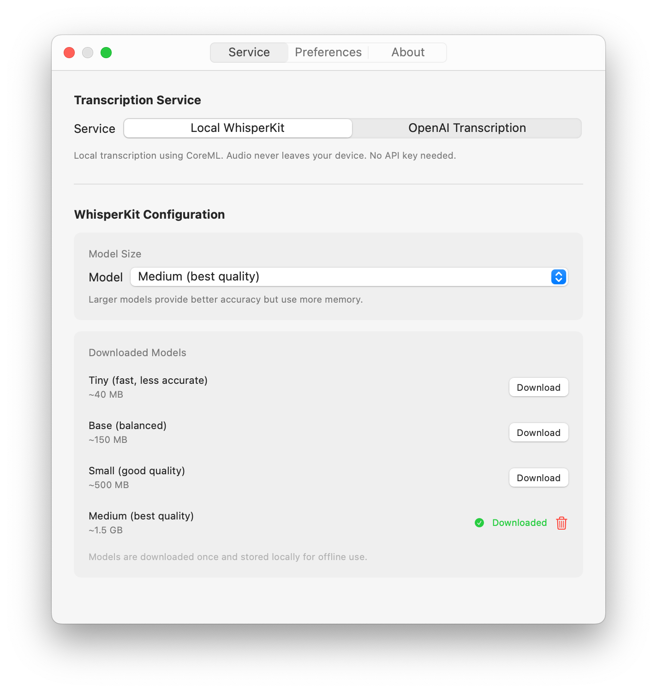

# VoiceScribe

Let your voice do the work.

## Features

- **Global hotkey recording** - Press Option-Shift-Space to record from anywhere (customizable)
- **Dual transcription engines** - Choose between privacy-focused local [WhisperKit](https://github.com/argmaxinc/WhisperKit) (on-device, Apple Silicon only) or cloud-based OpenAI Transcription
- **Multiple AI models** - Download and switch between WhisperKit models (Tiny/Base/Small/Medium) or select OpenAI models (Whisper V2/GPT-4o/GPT-4o Mini)
- **Auto-paste** - Transcriptions paste directly into your active app
- **Transcription history** - Review past transcriptions anytime
- **Secure storage** - API keys encrypted in macOS Keychain

## Screenshots

### Menu Bar Interface


### Recording Workflow

<p align="center">
  
  
  
</p>

### Settings

<p align="center">
  
  
</p>

## Installation

1. Download the latest release
2. Move `VoiceScribe.app` to Applications
3. **Right-click** and select **"Open"** (required for unsigned apps)

If you see "VoiceScribe is damaged", run:

```bash
xattr -cr /Applications/VoiceScribe.app
```

## Usage

- Press **Option-Shift-Space** to open the recording window
- Press **Space** to start/stop recording
- Transcription automatically copies to clipboard and pastes if enabled

### First Launch

1. VoiceScribe appears in your menu bar as a waveform icon
2. Click and select "Settings" to choose your transcription service:
   - Local [WhisperKit](https://github.com/argmaxinc/WhisperKit) (recommended) - Download a model to get started
   - OpenAI Transcription - Add your API key from [OpenAI](https://platform.openai.com/api-keys) and select a model (Whisper V2, GPT-4o, or GPT-4o Mini)
3. Enable "Auto-paste" in Preferences and grant Accessibility permission if desired

## Requirements

- macOS 14.0 (Sonoma) or later
- Apple Silicon (M-series) Mac for local WhisperKit transcription
- Intel Macs supported with OpenAI Transcription API

## Privacy

- All audio processing happens on-device with [WhisperKit](https://github.com/argmaxinc/WhisperKit) (no network transmission)
- OpenAI mode sends audio to their servers - review [OpenAI's Privacy Policy](https://openai.com/policies/privacy-policy)
- API keys encrypted in macOS Keychain with device-only access
- No telemetry or analytics
