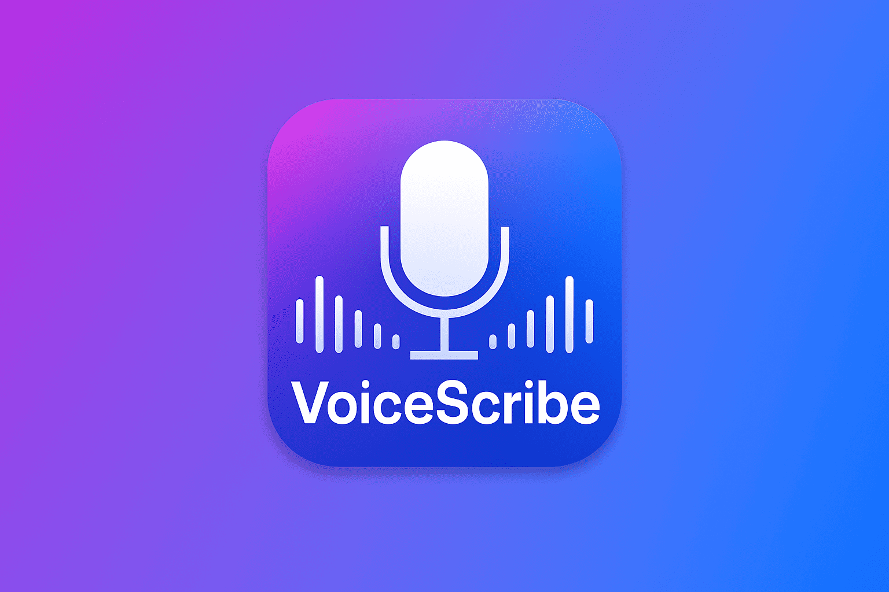
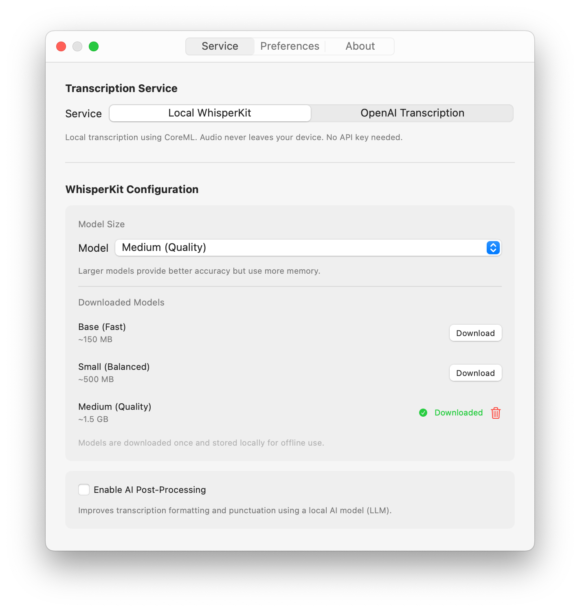
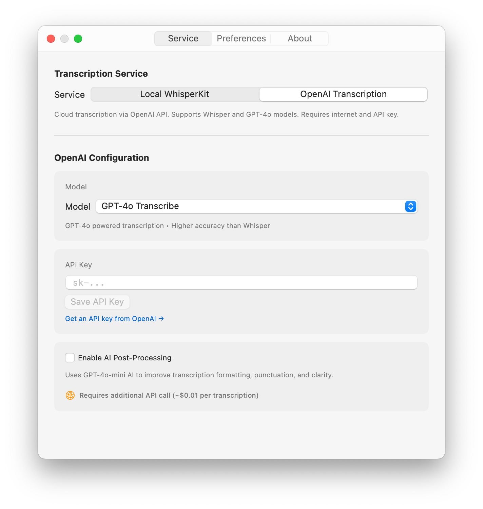
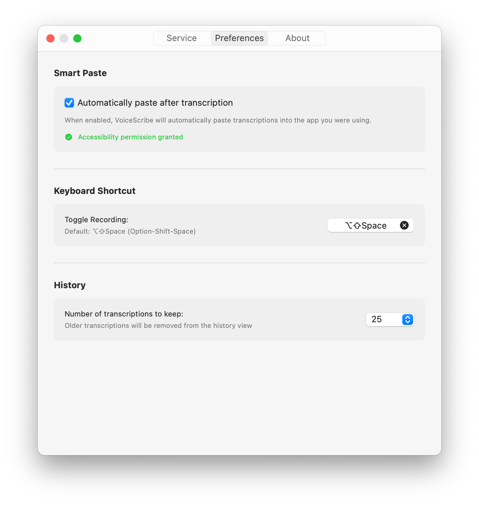
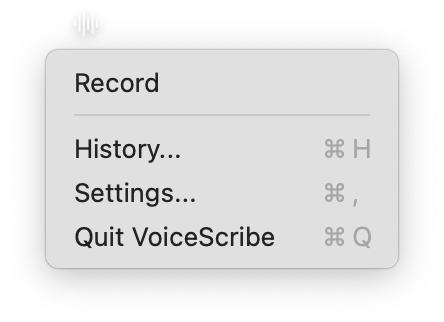

# VoiceScribe



Let your voice do the work.

## Features

- **Global hotkey recording** - Press Option-Shift-Space to record from anywhere (customizable)
- **Dual transcription engines** - Choose between privacy-focused local [WhisperKit](https://github.com/argmaxinc/WhisperKit) (on-device, Apple Silicon only) or cloud-based OpenAI Transcription
- **Multiple AI models** - Download and switch between WhisperKit models (Base/Small/Medium) or select OpenAI models (Whisper V2/GPT-4o/GPT-4o Mini)
- **AI-powered enhancement** - Optional post-processing to add perfect punctuation, capitalization, and formatting:
  - **Local mode**: 100% private on-device enhancement using MLX models (Qwen 2.5/Llama 3.2/Phi-3.5)
  - **Cloud mode**: Fast enhancement using OpenAI GPT-4o-mini
- **Auto-paste** - Transcriptions paste directly into your active app
- **Transcription history** - Review past transcriptions anytime
- **Secure storage** - API keys encrypted in macOS Keychain

## Screenshots

### Recording Workflow

<p align="center">
  
  
  
</p>

### History


### Settings

<p align="center">
  
  
</p>

<p align="center">
  
  
</p>

### Menu Bar



## Installation

1. Download the latest release
2. Move `VoiceScribe.app` to Applications
3. **Right-click** and select **"Open"** (required for unsigned apps)

If you see "VoiceScribe is damaged", run:

```bash
xattr -cr /Applications/VoiceScribe.app
```

## Usage

- Press **Option-Shift-Space** to open the recording window
- Press **Space** to start/stop recording
- Transcription automatically copies to clipboard and pastes if enabled

### First Launch

1. VoiceScribe appears in your menu bar as a waveform icon
2. Click and select "Settings" to choose your transcription service:
   - Local [WhisperKit](https://github.com/argmaxinc/WhisperKit) (recommended) - Download a model to get started
   - OpenAI Transcription - Add your API key from [OpenAI](https://platform.openai.com/api-keys) and select a model (Whisper V2, GPT-4o, or GPT-4o Mini)
3. Optionally enable "Enhance transcriptions" for AI-powered post-processing:
   - WhisperKit users can choose an MLX model for 100% private local enhancement
   - OpenAI users get cloud-based enhancement via GPT-4o-mini
4. Enable "Auto-paste" in Preferences and grant Accessibility permission if desired
5. Press **Option-Shift-Space** to start your first recording

## Requirements

- macOS 14.0 (Sonoma) or later
- Apple Silicon (M-series) Mac for local WhisperKit transcription and MLX enhancement
- Intel Macs supported with OpenAI Transcription API

## Privacy

VoiceScribe gives you full control over your data:

### Local Mode (WhisperKit + MLX)
- 100% private - All transcription and AI enhancement happens on-device
- No network transmission - Your audio and text never leave your Mac
- Ideal for sensitive content - Perfect for lawyers, doctors, journalists, and anyone handling confidential information
- Free - No API costs

### Cloud Mode (OpenAI)
- Audio transmission - Audio files sent to OpenAI servers for transcription
- Optional text enhancement - If post-processing enabled, transcribed text sent to OpenAI for formatting
- API costs - Approximately $0.006-0.024/minute for transcription, ~$0.004 additional if enhancement enabled
- Review [OpenAI's Privacy Policy](https://openai.com/policies/privacy-policy) for details

### Security Features
- API keys encrypted in macOS Keychain with device-only access
- Audio files stored in temporary directory and automatically deleted after transcription
- Transcription history stored locally with SwiftData
- No telemetry or analytics
