# VoiceScribe

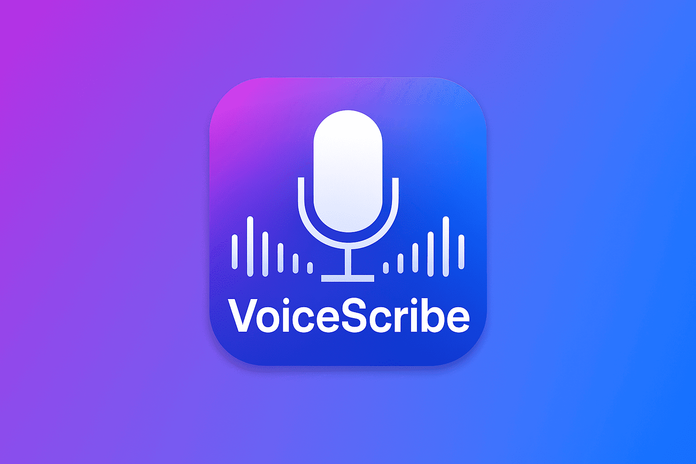

Let your voice do the work.

## What it does

VoiceScribe is a local macOS dictation app that lives in the menu bar. Use a global hotkey, speak, and it returns text to the app you are using.

The app runs a simple on-device pipeline:

1. Record audio from anywhere on macOS
2. Transcribe with Whisper or Parakeet
3. Optionally clean the transcript with a Local LLM
4. Copy or paste the final result back into your active app
5. Save the original transcript and optional processed version together in history

## Features

- Global hotkey recording with `Option-Shift-Space`
- Local transcription with Whisper or Parakeet
- Optional Local LLM cleanup for punctuation and formatting
- Downloadable local models for each stage
- History that keeps the original transcript and optional processed result
- Copy or auto-paste of the final result
- No cloud account or API key

## Screenshots

### Recording Workflow

<p align="center">
  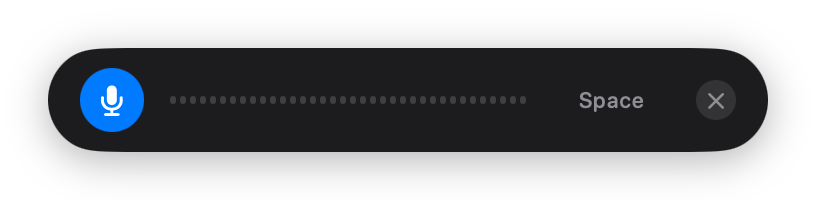
  
  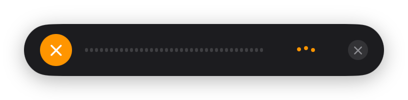
  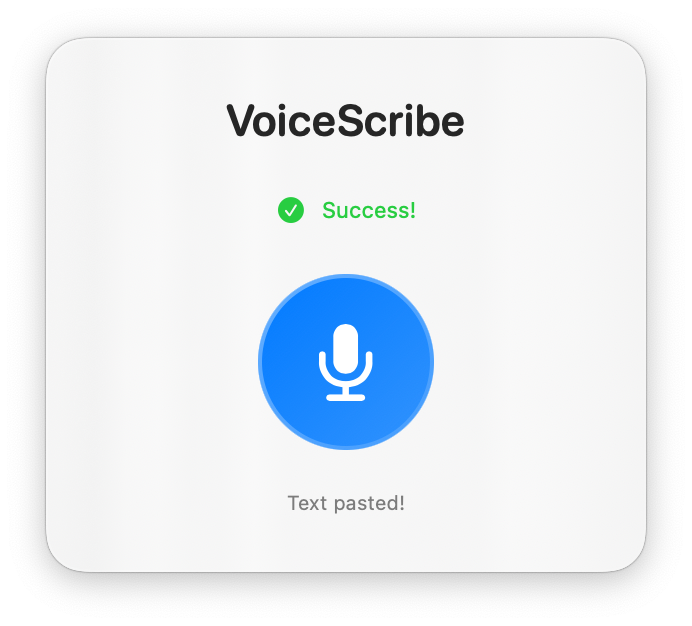
  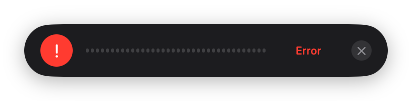
</p>

### History

<p align="center">
  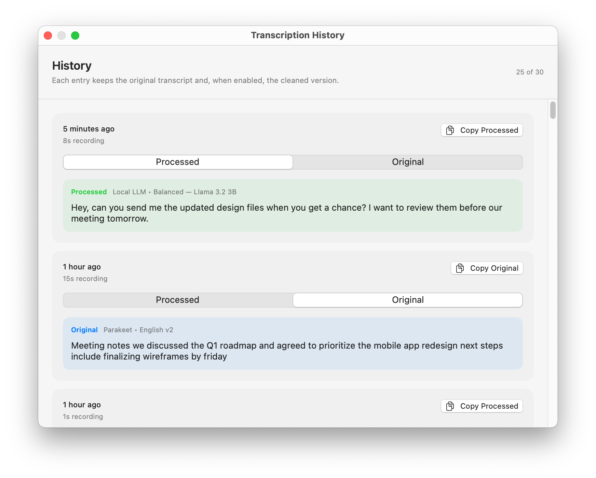
</p>

### Settings

<p align="center">
  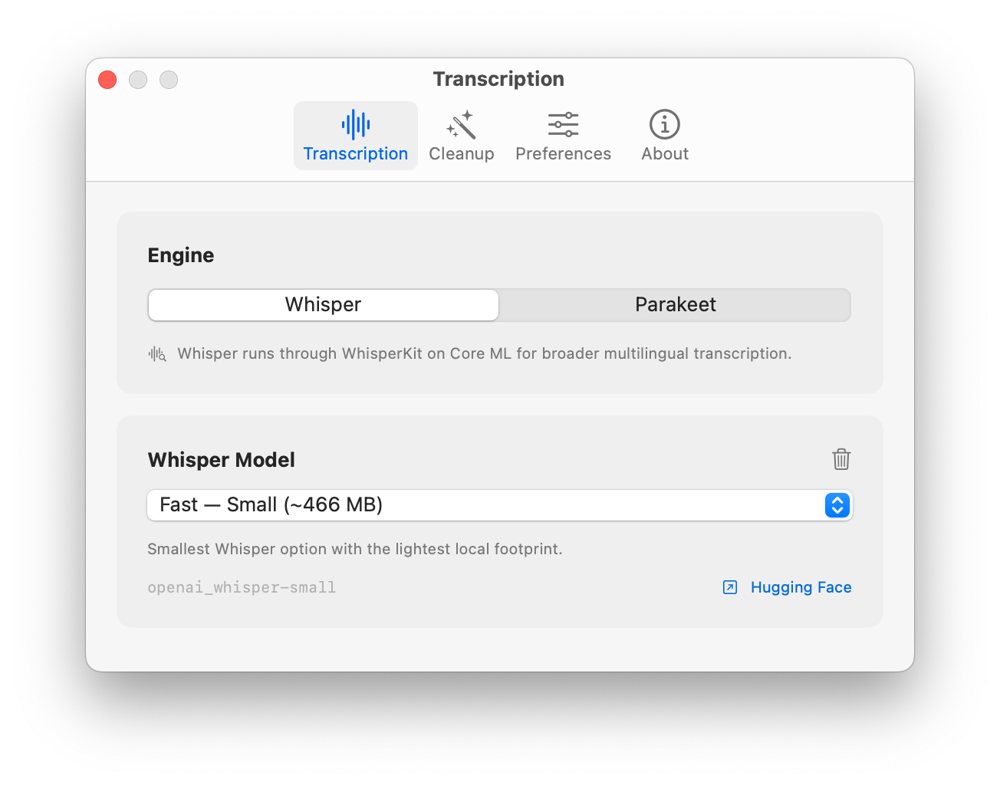
  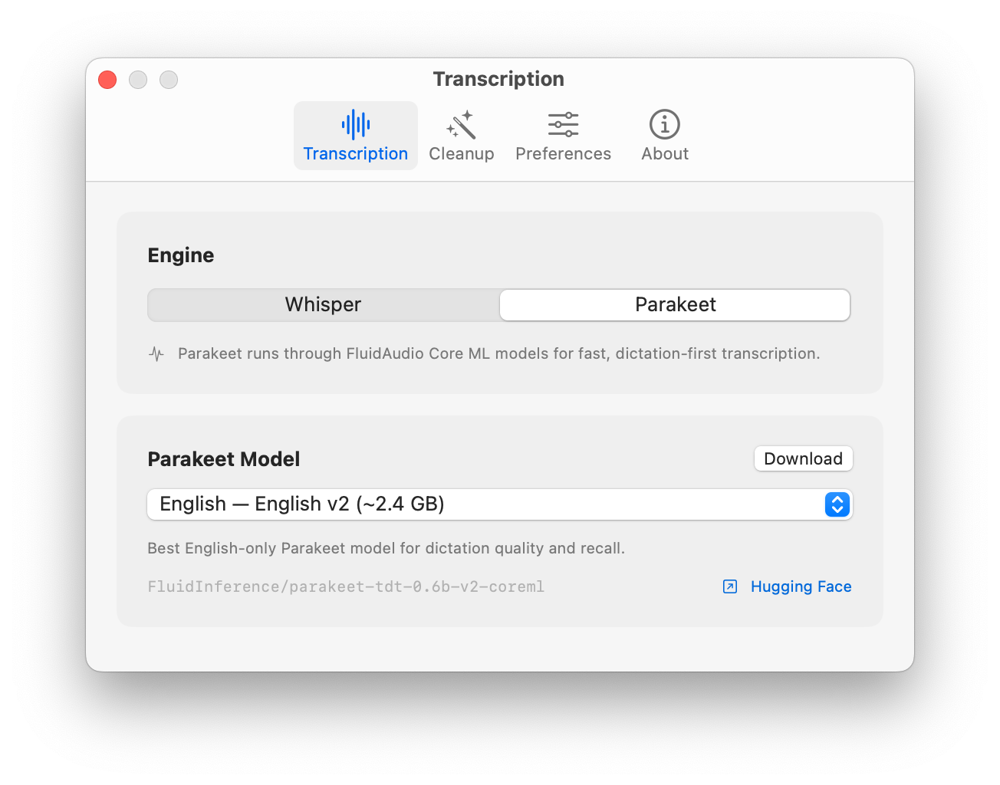
  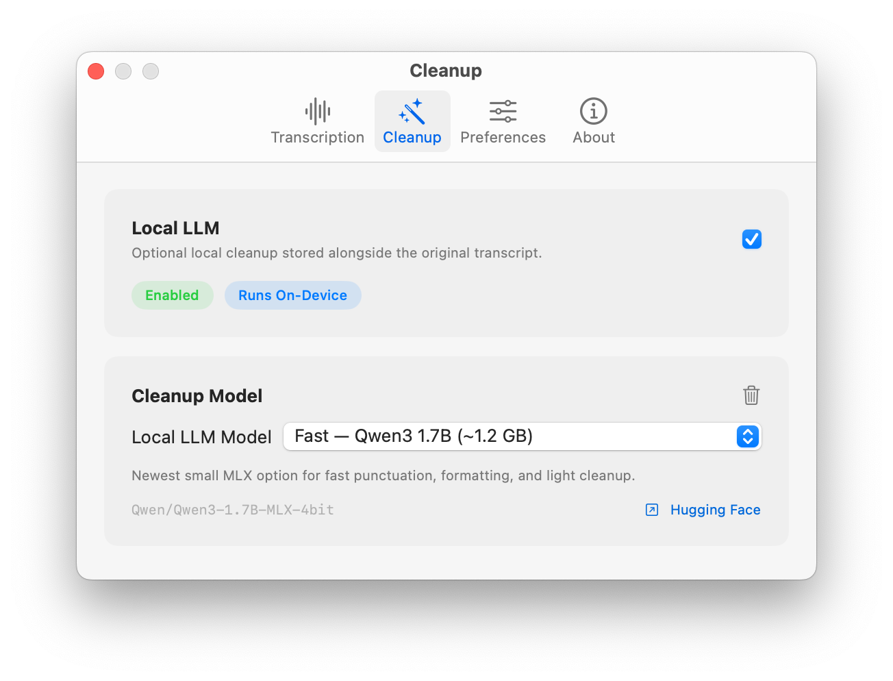
</p>

<p align="center">
  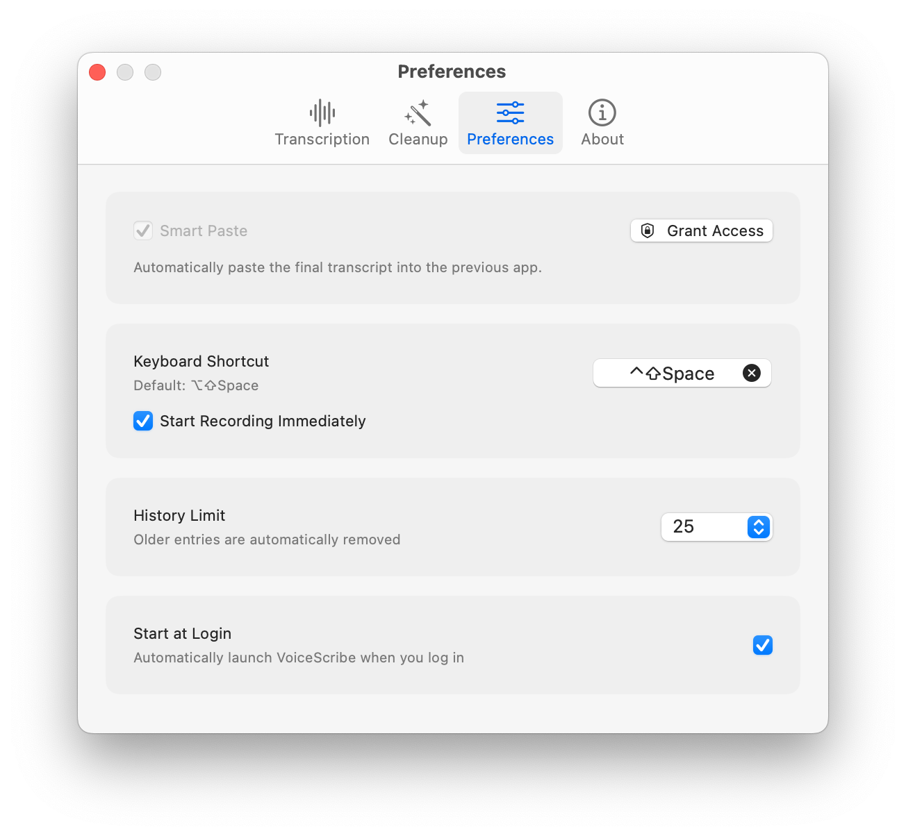
  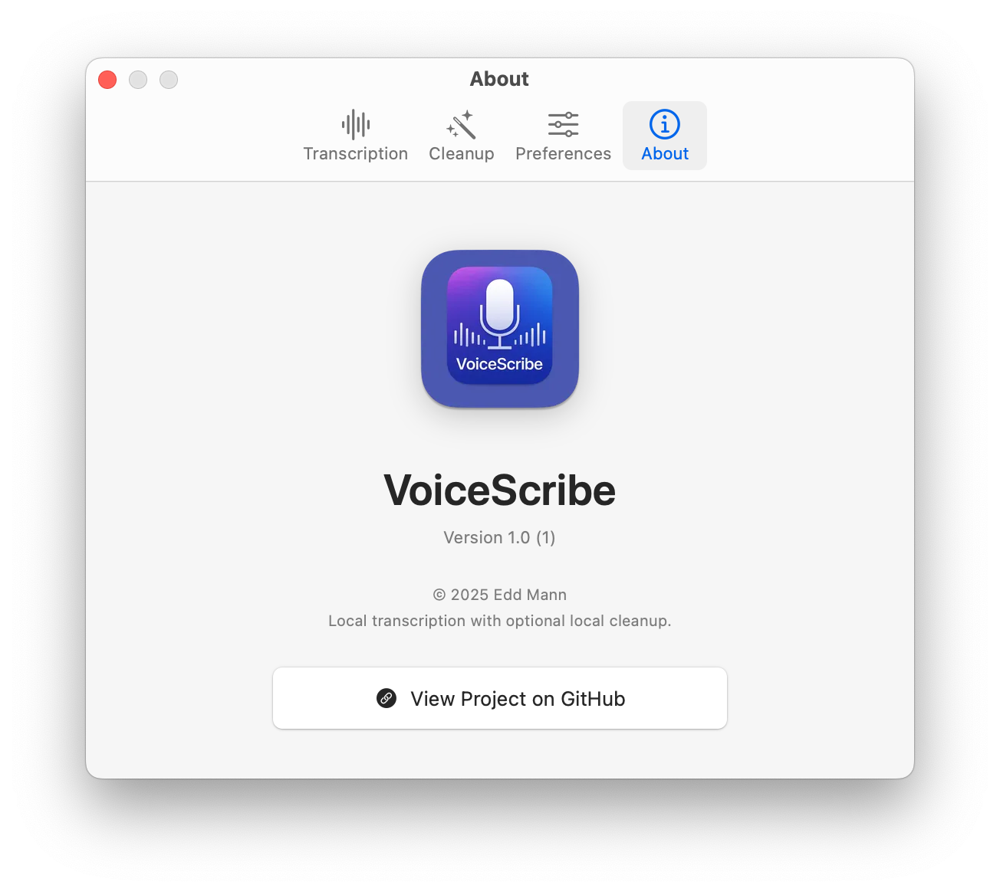
</p>

## How it works

### Transcription

VoiceScribe supports two local transcription engines:

- Whisper
  - Fast — [Small](https://huggingface.co/argmaxinc/whisperkit-coreml/tree/main/openai_whisper-small)
  - Balanced — [Distil Large v3](https://huggingface.co/argmaxinc/whisperkit-coreml/tree/main/distil-whisper_distil-large-v3_594MB)
  - Best — [Large v3](https://huggingface.co/argmaxinc/whisperkit-coreml/tree/main/openai_whisper-large-v3-v20240930_626MB)
- Parakeet
  - English — [English v2](https://huggingface.co/FluidInference/parakeet-tdt-0.6b-v2-coreml)
  - Multilingual — [Multilingual v3](https://huggingface.co/FluidInference/parakeet-tdt-0.6b-v3-coreml)

### Cleanup

The optional cleanup pass runs locally with MLX-backed LLMs:

- Local LLM
  - Fast — [Qwen3 1.7B](https://huggingface.co/Qwen/Qwen3-1.7B-MLX-4bit)
  - Balanced — [Llama 3.2 3B](https://huggingface.co/mlx-community/Llama-3.2-3B-Instruct-4bit)
  - Best — [Qwen3 4B](https://huggingface.co/Qwen/Qwen3-4B-MLX-4bit)

### History

History mirrors the pipeline directly:

- If cleanup is disabled, history stores only the original transcript
- If cleanup is enabled, history stores both the original and processed versions
- The History window lets you switch between `Processed` and `Original` before copying

## Installation

### Homebrew (Recommended)

```bash
brew install eddmann/tap/voicescribe
```

### Manual Download

1. Download the latest release from [GitHub Releases](https://github.com/eddmann/VoiceScribe/releases)
2. Unzip and move `VoiceScribe.app` to Applications
3. Double-click to open

The app is signed and notarized by Apple.

## Usage

- Press `Option-Shift-Space` to open the recording window
- Press `Space` to start or stop recording
- VoiceScribe copies the final transcript and pastes it if enabled

### First launch

1. Open `Settings`
2. In `Transcription`, choose `Whisper` or `Parakeet` and the model you want to use
3. In `Cleanup`, optionally enable `Local LLM` and choose a cleanup model
4. In `Preferences`, enable auto-paste if desired
5. Grant microphone access when macOS asks
6. Press `Option-Shift-Space` to start your first recording

## Requirements

- macOS 14.0 or later
- Apple Silicon Mac
- Internet connection for first-time model downloads only

## Development

Common commands:

```bash
make help
make test
make build
make dev
make can-release
```

Open the project in Xcode if needed:

```bash
open VoiceScribe.xcodeproj
```

## Built with

- [WhisperKit](https://github.com/argmaxinc/WhisperKit) - local Whisper transcription on Core ML
- [FluidAudio](https://github.com/FluidInference/FluidAudio) - local Parakeet transcription on Core ML
- [MLX Swift Examples](https://github.com/ml-explore/mlx-swift-examples) - local LLM cleanup
- [The Composable Architecture](https://github.com/pointfreeco/swift-composable-architecture) - app state and workflow orchestration
- [KeyboardShortcuts](https://github.com/sindresorhus/KeyboardShortcuts) - global hotkey management

## Privacy

VoiceScribe is local-only after the initial model download:

- Audio and transcript processing stay on-device
- No cloud transcription path
- No API keys, accounts, or usage fees
- No telemetry or analytics
- History is stored locally with SwiftData
- Temporary audio files are deleted after transcription

## License

[MIT](LICENSE)
